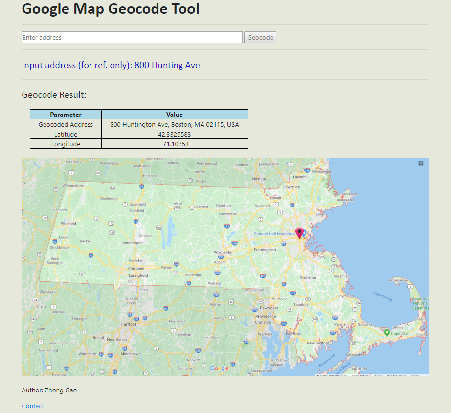

<h2>Django_google_map_API_geocode</h2>
<h4>A Django web app that invokes google maps geocode API call, allowing manually entered addresses to be standardized and geocoded. For instance, manually entering "800 Hunting Ave" will result in:</h4>
<ul>
  <li>A standardized address of "800 Hunting Ave, Boston MA 02115, USA"</li>
  <li>Latitude of "42.3329583"</li>
  <li>Longitude of "-71.10753"</li>
</ul>

  
    Google Maps bias towards local address matches, so your mileage may vary. A quick search yielded that there's a "800 Huntington Ave" address in NY, so if you're reside in NY, Google Maps geocode API will likely
  
  <b>(sensibly)</b>
  return that address instead.

</img>

<h4>This particular web app will throw a warning when the geocoded address is outside of Massachusetts, since in the particular case where this web app is used, the addresses should always be within MA. You can change this by checking the geocoded JSON object.</h4>

Refs:
 
<a href="https://developers.google.com/maps/documentation/geocoding/start#sample-request">Google Maps Geocode API</a>
 
<a href="https://developers.google.com/maps/documentation/javascript/overview">Google Maps Javascript API, though intentionally not used in this case.</a>
